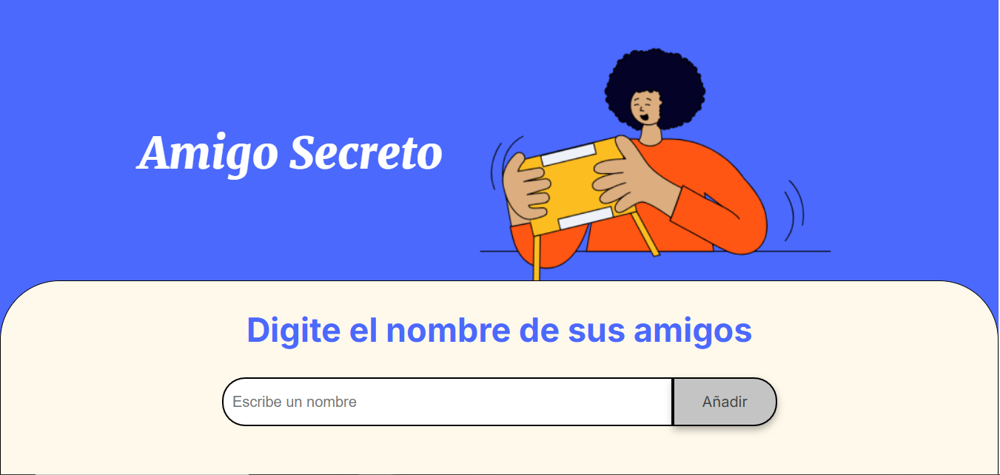

# Challenge: AMIGO SECRETO

   
   
   

 
<h2>Introducción</h2>
En este _Challenge_, se ha desarrollado una aplicación que permite a los usuarios ingresar nombres de amigos en una lista para luego realizar un sorteo aleatorio y determinar quién es el "amigo secreto".

El usuario deberá agregar nombres mediante un campo de texto y un botón "Añadir". Los nombres ingresados se mostrarán en una lista visible en la página, y al finalizar, un botón "Sortear Amigo" seleccionará uno de los nombres de forma aleatoria, mostrando el resultado en pantalla.

## :hammer:Funcionalidades del proyecto

1. `Agregar Amigos`: Los usuarios escribirán el nombre de un amigo en un campo de texto y lo agregarán a una lista visible al hacer clic en "Añadir".
   
3. `Validar entrada`: Si el campo de texto está vacío, el programa mostrará una alerta pidiendo un nombre válido.
   
5. `Visualizar lista`: Los nombres ingresados aparecerán en una lista debajo del campo de entrada.
   
7. `Sortear Amigos`: Al hacer clic en el botón "Sortear Amigo", se seleccionará aleatoriamente un nombre de la lista y se mostrará en la página.
   
9. `Nuevo Juego`: Al presionar este botón, todos los nombres previamente escritos y mostrados en pantalla se borrarán, permitiendo iniciar un "Nuevo Sorteo".
   
